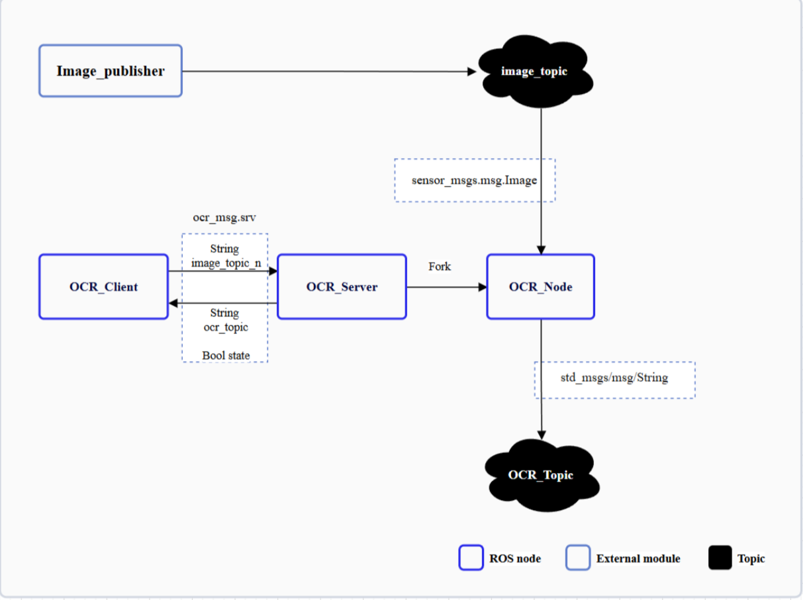

<div align="center">
  <h1>OCR Service</h1>
  <p align="center">
  </p>
  <p>ROS2 Package for OCR Service</p>

  <a href="https://ubuntu.com/download/qualcomm-iot" target="_blank"></a>
  <a href="https://docs.ros.org/en/jazzy/" target="_blank"></a>

</div>

---
## 👋 Overview

[OCR Service](https://github.com/qualcomm-qrb-ros/ocr_service) is a Project provide ROS2 package written by python for OCR(Optical Character Recognition). It contains:

* Standard ROS Node support Image topic input & Text topic output.
* User guide covers:
  - Service definitions, inputs, and outputs  
  - Installing the Debian package & dependencies via Ubuntu PPA  
  - Running project executables  
  - Building the project from source  

<div align="center">
  
</div>

<br>

`ocr_service` subscribe image topic input & output text topic output.

## 🔎 Table of contents
  * [Supported targets](#-supported-targets)
  * [APIs](#-apis)
  * [Installation](#-installation)
  * [Usage](#-usage)
  * [Build from source](#-build-from-source)
  * [Contributing](#-contributing)
  * [Contributors](#%EF%B8%8F-contributors)
  * [License](#-license)
## 🎯 Supported targets

<table >
  <tr>
    <th>Development Hardware</th>
    <td>Qualcomm Dragonwing™ RB3 Gen2</td>
    <td>Qualcomm Dragonwing™ IQ-9075 EVK</td>
  </tr>
  <tr>
    <th>Hardware Overview</th>
    <th><a href="https://www.qualcomm.com/developer/hardware/rb3-gen-2-development-kit"></a></th>
    <th><a href="https://www.qualcomm.com/products/internet-of-things/industrial-processors/iq9-series/iq-9075"></a></th>
  </tr>
</table>
---

## 🎯 APIs
### Client

| input                                 | output                                                        |
| ------------------------------------- | ------------------------------------------------------------- |
| Topic name : image topic name(String) | Topic name : OCR result (String) <br>OCR request status: Bool |

### Server and Process Node：

| Input                     | Output                 |
| ------------------------- | ---------------------- |
| Topic : sensor_msgs/Image | Topic : Std_msg/String |

### Test Node:

| Input                     | Output                                              |
| ------------------------- | --------------------------------------------------- |
| String : image topic name <br> String : picture path |  Topic : sensor_msgs/Image |
## Service msg

### ocr_service::ocr_msg::OcrRequest

```
string image_topic_name
---
string ocr_topic_name
bool success
```
---

## ✨ Installation

### Add Qualcomm IoT PPA for Ubuntu

```bash
sudo add-apt-repository ppa:ubuntu-qcom-iot/qcom-ppa
sudo add-apt-repository ppa:ubuntu-qcom-iot/qirp
sudo apt update
```

### Install Debian Package

```bash
sudo apt install ros-jazzy-ocr-service
```

### Install Python Dependencies

```bash
pip3 install pytesseract
```
---
## 🚀 Usage

```bash
# Terminal 1: launch ocr_server
export HOME=/home
source /opt/ros/jazzy/setup.bash
ros2 run ocr_service ocr_server
```

```bash
# Terminal 2: launch ocr_testnode
export HOME=/home
source /opt/ros/jazzy/setup.sh
ros2 run ocr_service ocr_testnode --topic <image_topic> --picture <image_path>
```

```bash
# Terminal 3: launch ocr_client
export HOME=/home
source /opt/ros/jazzy/setup.sh
ros2 run ocr_service ocr_client <image_topic>
```

---

## 🧱 Build From Source

### Dependencies

```bash
apt install ros-jazzy-example-interfaces ros-jazzy-ocr-msg python3-setuptools
```

### Build OCR_Service

```bash
git clone https://github.com/qualcomm-qrb-ros/ocr_service.git
colcon build
```

---

## 🤝 Contributing

We love community contributions! Get started by reading our [CONTRIBUTING.md](CONTRIBUTING.md).<br>
Feel free to create an issue for bug report, feature requests or any discussion💡.

## ❤️ Contributors

Thanks to all our contributors who have helped make this project better!

<table>
  <tr>
    <td align="center"><a href="https://github.com/whisper-chen"><br /><sub><b>Whisper-chen</b></sub></a></td>
  </tr>
</table>

## 📄 License

This project is licensed under the **BSD 3-Clause-Clear (“New” or “Revised”) License**.
